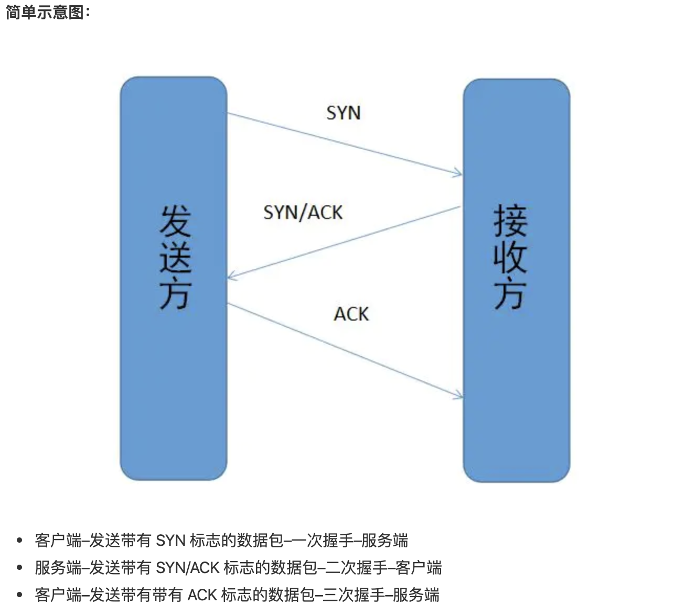
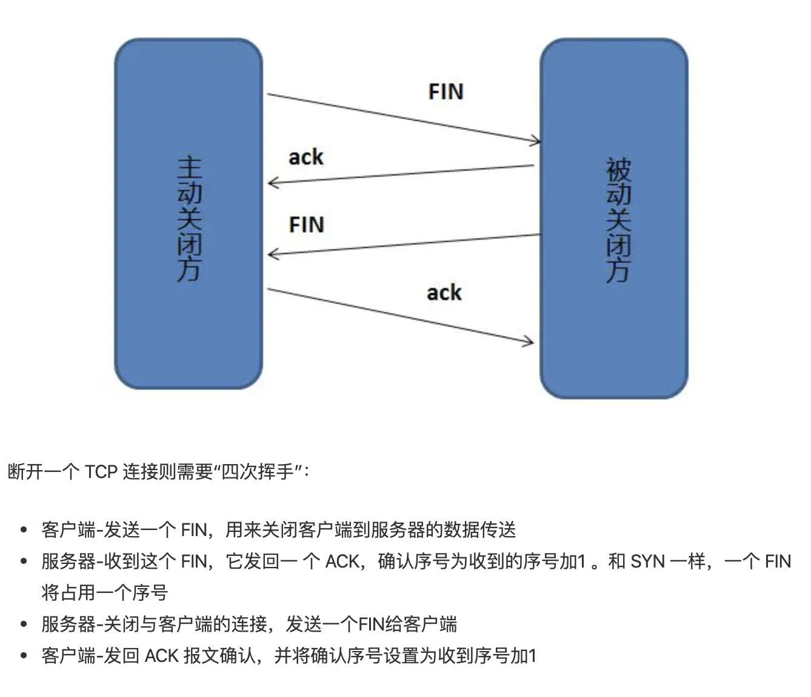

# TCP 三次握手和四次挥手



## 为什么要三次握手
**三次握手的目的是建立可靠的通信信道，说到通讯，简单来说就是数据的发送与接收，而三次握手最主要的目的就是双方确认自己与对方的发送与接收是正常的。**
第一次握手：Client 什么都不能确认；Server 确认了对方发送正常
第二次握手：Client 确认了：自己发送、接收正常，对方发送、接收正常；	 			Server 确认了：自己接收正常，对方发送正常
第三次握手：Client 确认了：自己发送、接收正常，对方发送、接收正常；				Server 确认了：自己发送、接收正常，对方发送接收正常
所以三次握手就能确认双发收发功能都正常，缺一不可。

## 为什么要传回SYN
接收端传回发送端所发送的 SYN 是为了告诉发送端，我接收到的信息确实就是你所发送的信号了。

## 传了SYN，为什么还要传ACK
双方通信无误必须是两者互相发送信息都无误。传了 SYN，证明发送方到接收方的通道没有问题，但是接收方到发送方的通道还需要 ACK 信号来进行验证。
```
SYN 是 TCP/IP 建立连接时使用的握手信号。在客户机和服务器之间建立正常的 TCP 网络连接时，客户机首先发出一个 SYN 消息，服务器使用 SYN-ACK 应答表示接收到了这个消息，最后客户机再以 ACK(Acknowledgement[汉译：确认字符 ,在数据通信传输中，接收站发给发送站的一种传输控制字符。它表示确认发来的数据已经接受无误。 ]）消息响应。这样在客户机和服务器之间才能建立起可靠的TCP连接，数据才可以在客户机和服务器之间传递。
```




## 为什么要四次握手
任何一方都可以在数据传送结束后发出连接释放的通知，待对方确认后进入半关闭状态。当另一方也没有数据再发送的时候，则发出连接释放通知，对方确认后就完全关闭了TCP连接。
举个例子：A 和 B 打电话，通话即将结束后，A 说“我没啥要说的了”，B回答“我知道了”，但是 B 可能还会有要说的话，A 不能要求 B 跟着自己的节奏结束通话，于是 B 可能又巴拉巴拉说了一通，最后 B 说“我说完了”，A 回答“知道了”，这样通话才算结束。

