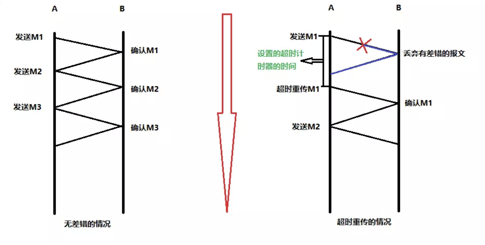
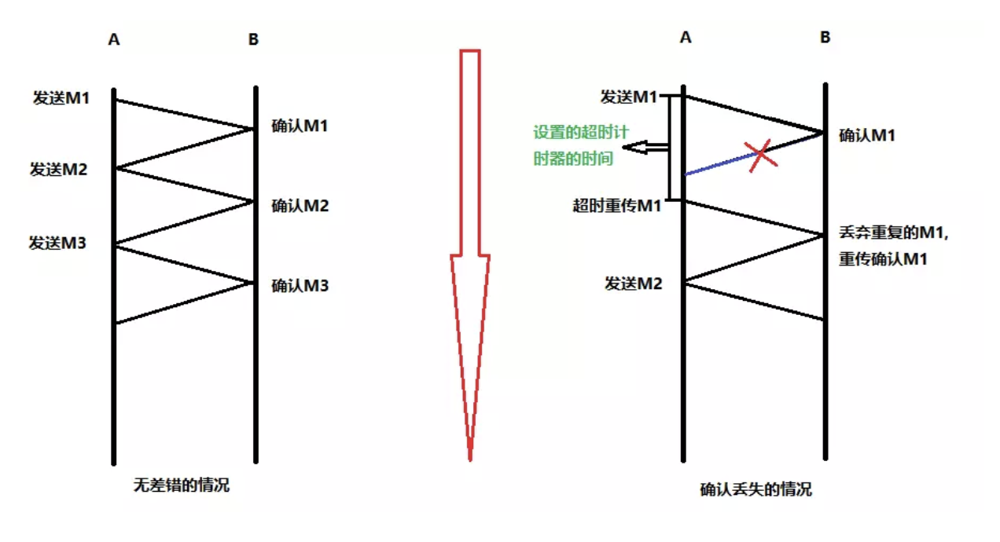

# TCP 协议如何保证可靠传输
1. 应用数据被分割成 TCP 认为最适合发送的数据块。
2. TCP 给发送的每一个包进行编号，接收方对数据包进行排序，把有序数据传送给应用层。
3. **校验和：** TCP 将保持它首部和数据的检验和。这是一个端到端的检验和，目的是检测数据在传输过程中的任何变化。如果收到段的检验和有差错，TCP 将丢弃这个报文段和不确认收到此报文段。
TCP 的接收端会丢弃重复的数据。
4. **流量控制：** TCP 连接的每一方都有固定大小的缓冲空间，TCP的接收端只允许发送端发送接收端缓冲区能接纳的数据。当接收方来不及处理发送方的数据，能提示发送方降低发送的速率，防止包丢失。::TCP 使用的流量控制协议是可变大小的滑动窗口协议。:: （TCP 利用滑动窗口实现流量控制）
5. **拥塞控制：** 当网络拥塞时，减少数据的发送。
6. **停止等待协议** 也是为了实现可靠传输的，它的基本原理就是每发完一个分组就停止发送，等待对方确认。在收到确认后再发下一个分组。 
7. **超时重传：** 当 TCP 发出一个段后，它启动一个定时器，等待目的端确认收到这个报文段。如果不能及时收到一个确认，将重发这个报文段。

## 停止等待协议
* 停止等待协议是为了实现可靠传输的，它的基本原理就是每发完一个分组就停止发送，等待对方确认。在收到确认后再发下一个分组；
* 在停止等待协议中，若接收方收到重复分组，就丢弃该分组，但同时还要发送确认；
**1) 无差错情况:**
发送方发送分组,接收方在规定时间内收到,并且回复确认.发送方再次发送。
**2) 出现差错情况（超时重传）:**

停止等待协议中超时重传是指只要超过一段时间仍然没有收到确认，就重传前面发送过的分组（认为刚才发送过的分组丢失了）。因此每发送完一个分组需要设置一个超时计时器，其重转时间应比数据在分组传输的平均往返时间更长一些。这种自动重传方式常称为 **自动重传请求 ARQ** 。另外在停止等待协议中若收到重复分组，就丢弃该分组，但同时还要发送确认。**连续 ARQ 协议** 可提高信道利用率。发送维持一个发送窗口，::凡位于发送窗口内的分组可连续发送出去::，而不需要等待对方确认。接收方一般采用累积确认，对按序到达的最后一个分组发送确认，表明到这个分组位置的所有分组都已经正确收到了。
**3) 确认丢失和确认迟到**
- **确认丢失**：确认消息在传输过程丢失

当A发送M1消息，B收到后，B向A发送了一个M1确认消息，但却在传输过程中丢失。而A并不知道，在超时计时过后，A重传M1消息，B再次收到该消息后采取以下两点措施：
1. 丢弃这个重复的M1消息，不向上层交付。
2. 向A发送确认消息。（不会认为已经发送过了，就不再发送。A能重传，就证明B的确认消息丢失）。
- **确认迟到** ：确认消息在传输过程中迟到

A发送M1消息，B收到并发送确认。在超时时间内没有收到确认消息，A重传M1消息，B仍然收到并继续发送确认消息（B收到了2份M1）。此时A收到了B第二次发送的确认消息。接着发送其他数据。过了一会，A收到了B第一次发送的对M1的确认消息（A也收到了2份确认消息）。处理如下：
1. A收到重复的确认后，直接丢弃。
2. B收到重复的M1后，也直接丢弃重复的M1。

